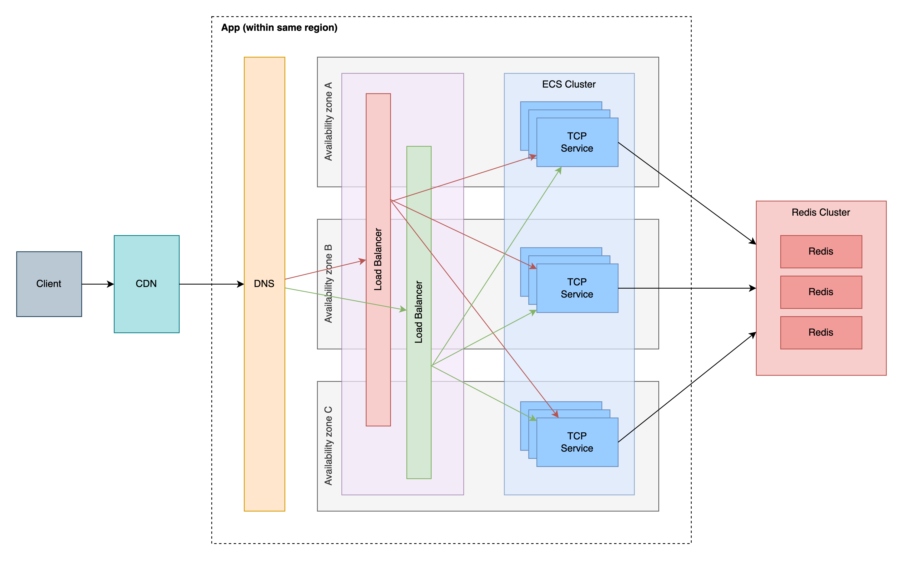
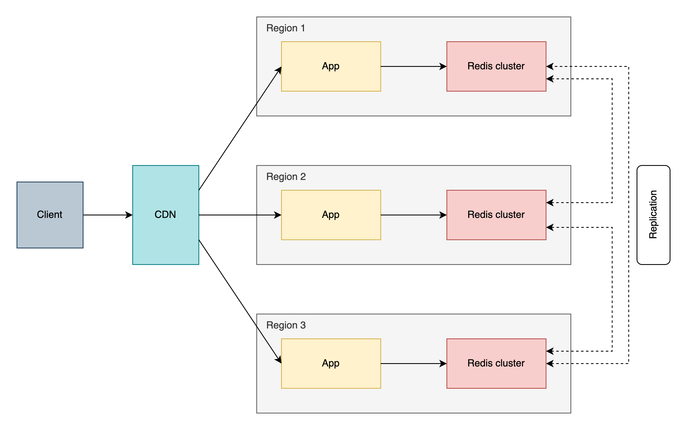

# Recommendations

Running a simple TCP service in a single machine/VM/container is not as reliable as having more robust/complex architectures.
Adding new components/infrastructure to the service can increase reliability, but will also make it more comple and add points of failure, which we should consider as part of the solution.

## Multiple nodes and load balancer

The first thing to change, is to run the service in more than one node (server/vm/container). It's a best practice to start with 3, so if any one fails, we still have 2 to serve the requests. By adding more nodes, we now have multiple nodes listening the same port on different hosts/ips, so we have to add a load balancer to have a unique entry point and route/balance the requests to the multiple nodes running the service.

With this change we already have a great increase in terms of reliability. Now we can have up to 2 nodes failing and we will still be able to serve requests.

As discussed in the next steps of the initial solution, it would be great to have the service running on containers.
In order to make it more reliable, we can use services that will manage the container for us, like AWS ECS or a Kubernetes offering.
Let's move forward with AWS ECS Fargate which is simpler to manage and the cost is lower for non super high traffic scenarios. So now we have a managed service (ECS) controlling our containers, making sure that we always have at least 3 healthy containers. We can also setup auto scaling based on CPU, memory or other metrics provided by AWS, like number of requests per second, queue size and so on. This will add even more to our reliability as we won't stop serving requests if we reach the maximum capacity of all 3 containers.

### Application logic

Adding new nodes won't change the way we answer to the `WHERE` command, as we are assingning a new UUID to each server at startup. I won't go further on how UUIDs work, let's just assume we will have unique identifiers across the board when creating a new one.

Initially we had only one server, so counting the number of clients connected was simple, as we don't have to share data across multiple nodes. Now we need to add an external data source so we can share the data.

### Sharing data

One good tool for this scenario is a cacche server, like Redis. It provides us a cluster/multi node architecture, providing us a good level of reliability. Redis offers us persistence as well, so in case Redis is restarted, we don't lose data. I won't go too far on the Redis architecture, let's just consider it's a data source with enough reliability to allow us to move forward.

In redis we can store this data in different ways:

1. We can add an entry for each new client and then remove it when it's disconnected. Getting the total count of entries will give us total number of clients connected. We can set TTL to each entry, so in case of disconnection, we can invalidate the problematic clients and have a more accurate number.
1. We can add a tuple like (serverId, connectedClients), which will be updated by each server. Getting the sum of each entry will give us the total number of clients connected. If we have issues where the server can't update the number of clients connected, we may have innacurate numbers.

As pointed out, option #1 seems to be a better option, so let's consider we would implement this solution.

### Going further on the architecture

Now that we are serving requests from multiple managed nodes, with a single IP address/entry point (load balancer) and sharing data across nodes through Redis, we can consider that our reliability is much higher.

But what if the network where the containers are running is having issues? We can define that our ECS cluster will deploy containers to different availability zones (AZ) - allowing us to have 1 or more AZs down without stopping serving requests. Let's assume Redis is already running in a multi node, multi AZ architecture, so it will have the necessary reliability to not affect our service.

And what if the load balancer is having issues? Let's add another load balancer (or add 2, so we have 3). Now we have multiple IPs again. We have different options to have multiple load balancers and a single entry point:

1. DNS: A DNS server can resolve an address to multiple other end points, so we can configure an address like `service.fuchs.me` to go to multiple IPs or addresses, no matter if they are in the same network or not. This allows us to have multiple load balancers and one unique address as unique entry point, no matter where they are hosted.
2. CDN: CDN services/companies (like Cloudflare) commonly provide services like firewall, load balancer, content cache, DNS and many others. Once we decide to open the service to third parties (other companies, external to our network), we can start using services like these. They are not useful if we keep the service for internal use.
3. Load balancers: We can always add another layer of load balancers, but we have the single point of failure problem again. It increase the reliability as it's less likely to have 2 load balancers failing at the same time than only one.

So, for our exercise, we can add a CDN service for external clients and a DNS for internal usage.

As of now, after adding some components to our architecture, we have what is shown in the first diagram below: Single region view.

### Multi region

OK, now we have multiple load balancers, multiple nodes, multiple AZs/networks, DNS and CDN services and a Redis cluster. Our service is much more complex than the initial solution, but it's way less likely to fail completely and stop serving requests.

We are still in the same region (in terms of AWS concepts), so if a region is failing broader outages, we will stop serving requests.

To increase even further the reliability, we can add regions to our architecture. At the same time it adds reliability, it adds complexity. By having more regions, we have to have multiple region outages in order to stop serving requests, which is very unlikely to happen.

And again, now we have to deal with the multiple regions, multiple entry points and a new challenge: multiple data sources. Redis supports multi node clusters, but not multi region/datacenter clusters.
In order to answer to the `WHO` command with multi region architecture, we need to synchronize/replicate the data across the multiple regions. A good solution for Redis replication is [Dynomite](https://github.com/Netflix/dynomite).

### Active/active and active/passive architectures

When we add new components to our architecture, we can add then as active/active components (all components are always running and actively receving requests) or as active/passive components (one complete subset is active and other complete subset are not running or not actively serving requests).

The active/active solution is more complex to deal with as we have increased latency and components communicating across different regions/locations/datacenters. The data replication is always a challenge in active/active scenarios, as transfering data across distant physical locations takes time and introduces eventual consistency (when data is not always 100% consistent in all clusters, but they will eventually the same data). CDNs can help us with the latency issue as they consider the client physical location to serve a request - it will route the connection to the nearest available server.

The active/passive solution is less complex to deal with, specially in terms of data replication. As we don't need to serve data from multiple regions at the same time, we can have different replication approaches. A second region will become ative only if a region is down, so we may have a small downtime as we need to start/make the infrastructure active and re-route the requests to a different region.
The active/passive solution add less to the reliability comparing to the active/active solution, but the reliability will be higher than without extra inactive infrastructure. In case of single region architecture, if the region is down, the service will be down. With an extra inactive region, we will have downtime, but the service can come up again in a short amount of time. In the active/active solution, we have to region multiple region outages to have a complete outage in the service. And each region you add to it, the higher the availability, as it's less likely to have 2 regions down than 1, less likely to have 3 down than 2 and so on.

A high level representation of the multi region solution in the diagram below - Multi region view.

## Diagram - Single region view

## Diagram - Multi region view

## Points for discussion

- What considerations would you have if the SLO were 99.9999%?
  
  The architectures discussed in this document already cover this. By adding AZs, regions, number of containers, load balancers and so on will increase our reliability, thus allowing us to have a higher SLO.

- What changes would you encourage the product team to make in their requirements?
  
  Exposing a service/API to external clients requires an easier integration and easier usage. Exchanging ASCII characters through TCP connections is not best solution in this scenario. Moving a REST API approach would make integration and usage easier.

  To make the data replication/sharing solution less complex, we could return another type of response in the `WHO` command, like returning the average number of clients, or 95th percentile, 99th percentile, or make it clear that the response can have eventual consistency so we can return a response faster, without having to wait for the replication to take place every time we have an updated value.

- How does this service fit into a larger microservice ecosystem? What tooling will it require to make it useful?
  
  When adding a service that will communicate with other services in the same ecosystem, it's important to have a way to track what happened to the request across multiple services. We can have this by having a distributed transaction tracing.

  To help with tracing, it would be important to have central logging, so all services can have their logs in the same place, making it much simpler to troubleshoot issues and see the distributed tracing at the same place. This can be achieved by using an ELK stack based tool as mentioned before. And then the standard logging comes together with this, as we don't want to have each service with its own log format.

  It's also important to consider how one service affects the SLO of another one. We have to try to isolate the SLIs used in the SLO, so we can have a clear picture of each individual service. And, as nedded, have SLIs and SLOs related to integrated services. When we have SLOs across multiple services, it's important to consider that the combined services will likely have a lower SLO, as the outage of one will affect the SLO and the outage of multiple services will affect the SLO in exponential way.

  Going back to CI/CD and processes, it's important to have standards across the services. When we have 10 or 20 services, having custom CI/CD/processes for each service is still manageable. But once the ecosystem scale to dozens/hundreds of services, not having standard/shared/common CI/CD/processes will add too much complexity to this and the teams will start having important issues in this area.
